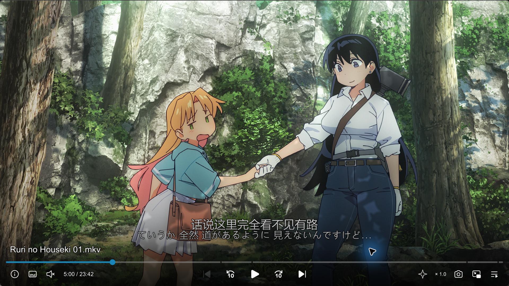
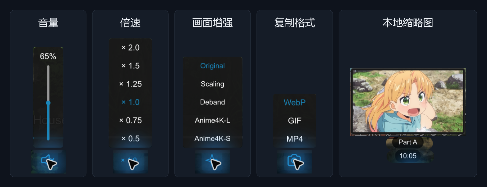
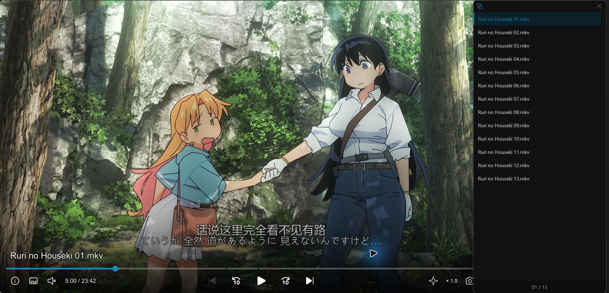
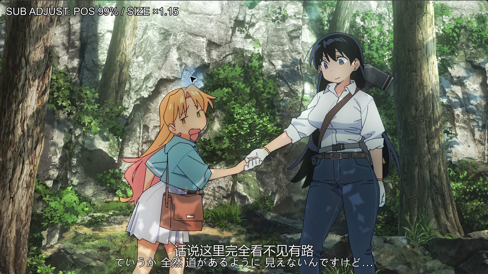
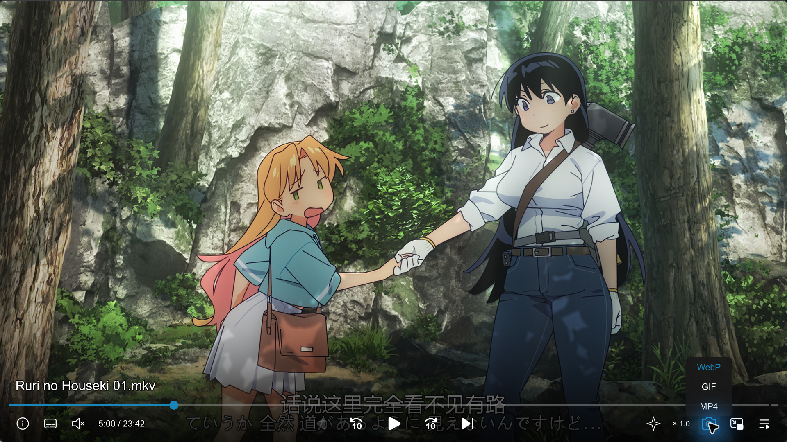

# mpvnet-kit

**mpvnet-kit 是一套面向 Windows mpv.net 的界面与功能定制方案。**

在 mpv.net 和 ModernZ 的基础上，调整控制栏与交互方式，开发独立播放列表、字幕调整、截图与片段导出等功能，并整理快捷键、操作反馈和画面增强预设。

当前版本：**0.1.0**。兼容基线为 mpv.net 7.1.2 / libmpv 0.41，其他版本和显示环境需自行确认。

## 主要特性

- **提供简洁、干净、实用、高效的 GUI 体验**：基于 ModernZ 整理控制栏布局、图标与提示，将速度、音量、画面增强和截图格式放入悬停浮层；配合自动隐藏、本地缩略图、章节与时间预览，让常用操作集中在视频周围。
- **实用好用的鼠标、快捷键与操作反馈**：梳理播放、定位、字幕和音频操作，提供长按空格临时加速、分级跳转、逐帧、标记与循环；用简短文字和按钮状态反馈显示操作结果。
- **独立于视频窗口的 Playlist GUI**：播放列表以独立侧窗展示，跟随主窗口位置，支持搜索、拖动排序、追加文件和双击切换；可自动补充同目录的同类媒体，方便连续观看。
- **按需切换的画面增强**：默认 Original，可恢复当前媒体的原生渲染基准；提供配置好的 Scaling 缩放、Deband 去色带和 Anime4K-L/S 增强预设方案，保持原帧率。
- **方便实用的观看体验**：
    - **截图分享**：同时支持动态静态截取；可快速截取源 PNG 截图直接复制到剪贴板；支持标记两端时间，导出 MP4、WebP、GIF 三种动态格式，选择其中指定格式进入剪贴板；支持截取内容按媒体标题整理输出目录。
    - **字幕调整**：支持快速调整延迟、位置和大小；支持快速复制当前字幕文本、按字幕时间定位。
    - **网页调起兼容**：可配合用户自行配置的 [External Player](https://greasyfork.org/zh-CN/scripts/518677-external-player)、[URL Scheme Handler](https://github.com/LuckyPuppy514/url-scheme-handler)，从浏览器调用 mpv.net。
    - **Bilibili 弹幕接入**：随包提供基于 [MPV-Play-BiliBili-Comments](https://github.com/itKelis/MPV-Play-BiliBili-Comments) 的兼容脚本及控制配置，无需重复安装原版；准备 Python 后，可在弹幕数据可用时加载、显示与调整弹幕。

具体按钮、快捷键和使用条件见[功能与操作指南](docs/features.md)。

更多演示：播放列表、字幕调整与片段截取

右侧空间不足时，播放列表采用实际覆盖布局。

演示已缩短操作之间的等待时间。

## 快速安装

1. 需要自行安装 [mpv.net](https://github.com/mpvnet-player/mpv.net/releases)。
2. （**推荐**）安装 [FFmpeg](https://www.ffmpeg.org/download.html) 和 [Python](https://www.python.org/downloads/windows/)，分别用于片段导出和弹幕转换。
3. 从本仓库 **Code → Download ZIP** 下载完整包并解压到独立目录，退出受影响的播放器。
4. 如果已有配置或脚本，请先自行备份并处理，安装器不会覆盖或合并它们，播放器状态和缓存可保留。
5. 双击 `Install.cmd`，点击 “浏览…” 选择 `mpvnet.exe`，等待自动检查，核对目录后点击右下角“确认安装”。完成后自行启动播放器。
6. （**推荐**）按 [External Player](https://greasyfork.org/zh-CN/scripts/518677-external-player) 的说明，自行配置浏览器脚本及配套的 [URL Scheme Handler](https://github.com/LuckyPuppy514/url-scheme-handler)，将播放器路径指向自己的 `mpvnet.exe`，实现网页视频快速调起。

安装版和便携版均可使用，只需选择播放器，配置目录会自动识别。

FFmpeg 和 Python 仅从当前 PATH 查找，不执行或下载程序，未发现不影响基本安装。本机路径可之后手动配置。

完整步骤、目录规则和重新安装方法见[安装指南](docs/installation.md)。

## 文档导航

| 指南 | 内容 |
| --- | --- |
| [安装与个人配置维护](docs/installation.md) | 安装准备、图形安装、可选组件和重新安装 |
| [功能与操作](docs/features.md) | **快捷键**、控制栏、字幕、Playlist、截图与增强 |
| [配置说明](docs/configuration.md) | 本机路径、外观、键位和个人参数 |

版本变化见[变更记录](CHANGELOG.md)。

## 已知问题与限制

- 网络缩略图默认关闭；网络播放、片段导出和弹幕仍受来源、读取权限及输入数据条件影响。
- 个人没有实际有效的 HDR 环境，没有针对 HDR 做针对性配置。
- Anime4K 仅在满足条件的 SDR 素材上启用，HDR 不启用；效果和性能取决于素材与 GPU。
- 片段导出采用兼容格式，不无损保留 HDR 或原色彩链路，也不烧入软字幕、弹幕和控制栏。
- Playlist 与主界面的默认间隙过大，影响观感。

## 后续计划

- 调整右键菜单。
- 对部分外观做优化、美化。
- 丰富画面增强方案，当前版本没有加入任何补帧方案。
- 丰富其他播放器功能。

## 致谢与许可

感谢以下项目的作者、维护者与贡献者：

- [mpv](https://github.com/mpv-player/mpv) / [mpv.net](https://github.com/mpvnet-player/mpv.net)：播放核心与 Windows 播放器。
- [ModernZ](https://github.com/Samillion/ModernZ)：控制栏及界面定制的基础。
- [thumbfast](https://github.com/po5/thumbfast)：进度条缩略图预览。
- [Anime4K](https://github.com/bloc97/Anime4K)：画面增强所用的 shader。
- [MPV-Play-BiliBili-Comments](https://github.com/itKelis/MPV-Play-BiliBili-Comments)：弹幕加载与转换组件的来源。
- [Google Material Symbols](https://github.com/google/material-design-icons) / [Microsoft Fluent System Icons](https://github.com/microsoft/fluentui-system-icons)：随 ModernZ 图标字体提供的图标来源。

可选功能还使用 [External Player](https://greasyfork.org/zh-CN/scripts/518677-external-player)、[URL Scheme Handler](https://github.com/LuckyPuppy514/url-scheme-handler)、[FFmpeg](https://www.ffmpeg.org/) 和 [Python](https://www.python.org/)，这些外部组件由用户自行准备。

独立自有代码、配置和文档采用 [MIT](LICENSE)；第三方组件及其派生修改分别遵循各自许可。完整来源、归属和许可范围见[组件许可](LICENSES.md)。
